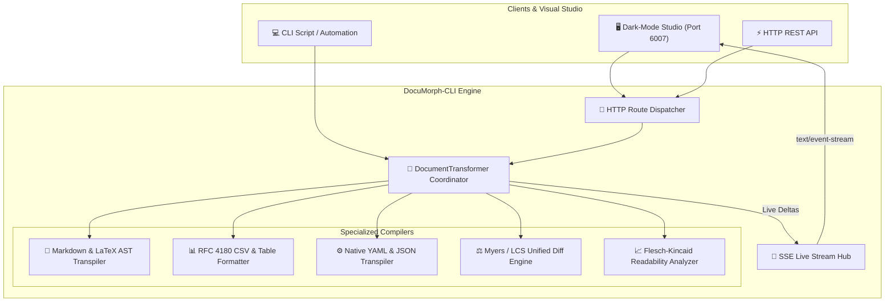

# ⚡ DocuMorph-CLI
> **Universal Document & AST Transpiler: Markdown, LaTeX Math, RFC 4180 CSV, YAML & LCS Diff**  
> *Developed autonomously by the 7-Agent SDLC Software Factory for [Ali Nurettin Demir](https://github.com/alinurettin)*

[]()
[-success.svg)]()
[]()
[]()
[](https://opensource.org/licenses/MIT)

---

## 🌟 Executive Summary & Value Proposition
Technical documentation, configuration files, and data tables exist across fragmented formats. Traditional toolchains require dozens of brittle third-party packages to parse Markdown, format CSVs, validate YAML, and compute text metrics.

**DocuMorph-CLI** is a zero-dependency, sub-millisecond document compiler engineered with pure Node.js standard libraries. It converts Markdown into semantic HTML5 and typed AST nodes, preserves complex LaTeX mathematical notation via token stashing, parses RFC 4180 CSVs, transpiles between YAML and JSON, computes unified LCS line diffs, and evaluates Flesch-Kincaid readability scores.

---

## 🏗️ System Architecture & Data Flow



---

## 🔬 Mathematical & Parsing Algorithms

### 1. Token Stashing Protocol for LaTeX Math
To eliminate token corruption between Markdown italic tags (`_..._`) and LaTeX mathematical syntax (e.g. `\int_{-\infty}^\infty`):
1. Extract math blocks `$$...$$` and inline `$..$` into an isolated memory stash.
2. Substitute with null-byte placeholders: `\x00STASH_i\x00`.
3. Format standard Markdown prose (bold, italic, links, lists).
4. Restore stashed tokens using functional callbacks (`() => stash[i]`) to prevent regex `$` escape sequence consumption.

### 2. Flesch-Kincaid Readability & Reading Ease
$$\text{Reading Ease} = 206.835 - 1.015 \left(\frac{\text{words}}{\text{sentences}}\right) - 84.6 \left(\frac{\text{syllables}}{\text{words}}\right)$$
$$\text{Grade Level} = 0.39 \left(\frac{\text{words}}{\text{sentences}}\right) + 11.8 \left(\frac{\text{syllables}}{\text{words}}\right) - 15.59$$

### 3. Longest Common Subsequence (LCS) Line Diff
Computes dynamic programming matrix $DP[i, j]$ across document line tokens and backtracks to generate standard unified diff blocks with added/deleted line counts.

---

## 🔌 API Specification & REST Endpoints

| Method | Endpoint | Description |
|---|---|---|
| `GET` | `/api/health` | Health status and uptime |
| `GET` | `/api/stats` | Transformation statistics and engine metrics |
| `POST` | `/api/transform/markdown` | Transpile Markdown into HTML and AST |
| `POST` | `/api/transform/csv` | Convert CSV into JSON array or Markdown table |
| `POST` | `/api/transform/yaml` | Transpile between YAML and JSON |
| `POST` | `/api/diff` | Compute line-by-line unified diff between two texts |
| `POST` | `/api/metrics` | Calculate word count, reading time, and Flesch readability |
| `GET` | `/api/events/stream` | Server-Sent Events (SSE) live broadcast stream |

### Markdown Transpilation Example
```bash
curl -X POST http://localhost:6007/api/transform/markdown \
  -H "Content-Type: application/json" \
  -d '{
    "markdown": "# Euler Formula\n$e^{i\\pi} + 1 = 0$"
  }'
```

---

## 🧪 Comprehensive Automated Testing & Verification
The test suite in `tests/run_tests.js` runs without external mocking libraries:

```bash
node tests/run_tests.js
```

### Verified Test Categories:
- **Markdown AST & Semantic HTML5 (7 assertions):** Headings with anchor IDs, blockquotes, inline tags, code blocks, lists, and tables.
- **LaTeX Math Support (1 assertion):** Inline and display math token preservation.
- **RFC 4180 CSV Transpiler (4 assertions):** Embedded commas in quotes, escaped quotes, JSON serialization, and Markdown table output.
- **Native YAML/JSON Transpiler (2 assertions):** Indentation-based YAML parsing and serialization.
- **Myers / LCS Diff Engine (1 assertion):** Added, deleted, and unchanged line counts.
- **Text Metrics & Readability (1 assertion):** Syllable heuristics, Flesch scores, and sentence counts.
- **Live Ephemeral HTTP REST & SSE Gateway (10 assertions):** Ephemeral socket integration.

---

## 🚀 Getting Started

### Local Node.js Execution
```bash
# 1. Clone repository
git clone https://github.com/alinurettin/DocuMorph-CLI.git
cd DocuMorph-CLI

# 2. Run automated test suite
npm test

# 3. Start engine
npm start
```
Open **`http://localhost:6007`** in your browser to access the live dashboard.

### Docker & Docker Compose
```bash
docker-compose up -d --build
```

---

## 📄 Artifacts & Documentation
- [Research Report](file:///C:/Users/alinurettin/.gemini/antigravity/scratch/projects/DocuMorph-CLI/artifacts/RESEARCH_REPORT.md)
- [Product Requirements Document (PRD)](file:///C:/Users/alinurettin/.gemini/antigravity/scratch/projects/DocuMorph-CLI/artifacts/PRD.md)
- [Architecture Blueprint](file:///C:/Users/alinurettin/.gemini/antigravity/scratch/projects/DocuMorph-CLI/artifacts/ARCHITECTURE.md)
- [QA & Verification Report](file:///C:/Users/alinurettin/.gemini/antigravity/scratch/projects/DocuMorph-CLI/artifacts/QA_REPORT.md)
- [Release Notes](file:///C:/Users/alinurettin/.gemini/antigravity/scratch/projects/DocuMorph-CLI/artifacts/RELEASE_NOTES.md)

---

## 📜 License
MIT License. Engineered autonomously by the 7-Agent SDLC Software Factory for Ali Nurettin Demir.
