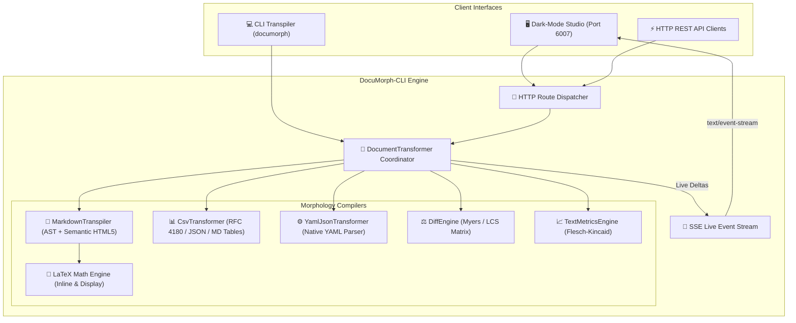

# 🏛️ Technical Architecture Document: DocuMorph-CLI
**Version:** 2.0.0  
**Domain:** Document Compilers & AST Morphology  
**Architect:** 7-Agent SDLC Principal Software Architect  

---

## 1. System Topology & Architecture

---

## 2. Subsystem Details

### 2.1 `MarkdownTranspiler` (`src/engine.js`)
- **Block-Level Lexer:** Detects headings, lists, tables, blockquotes, code blocks, thematic breaks, and display math.
- **Inline Token Stashing:** Stashes math equations and code snippets before formatting text, preventing escape conflicts.
- **AST Generation:** Produces clean JSON AST arrays alongside semantic HTML5.

### 2.2 `CsvTransformer` (`src/engine.js`)
- RFC 4180 state-machine scanner handling escaped quotation marks `""` and multi-line values.
- Bidirectional conversion between CSV text, JSON object arrays, and padded Markdown tables.

### 2.3 `YamlJsonTransformer` (`src/engine.js`)
- Indentation-aware YAML parser supporting nested objects, lists, and primitives without external packages.

### 2.4 `DiffEngine` (`src/engine.js`)
- Computes $O(N \cdot M)$ dynamic programming matrix to identify Longest Common Subsequences.
- Formats diffs into standard unified diff blocks with added/deleted line statistics.

### 2.5 `TextMetricsEngine` (`src/engine.js`)
- Analyzes phonetic vowel-cluster syllables, sentences, words, and characters.
- Computes Flesch Reading Ease and Flesch-Kincaid Grade Level scores.
